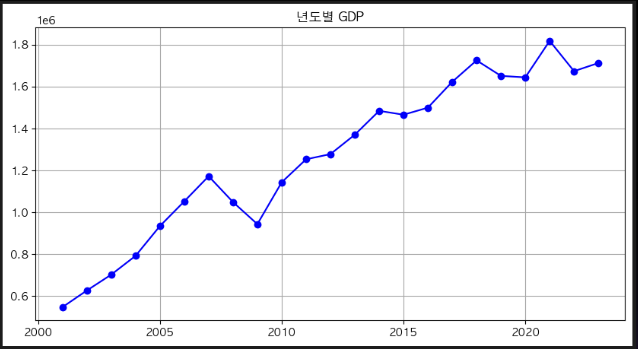
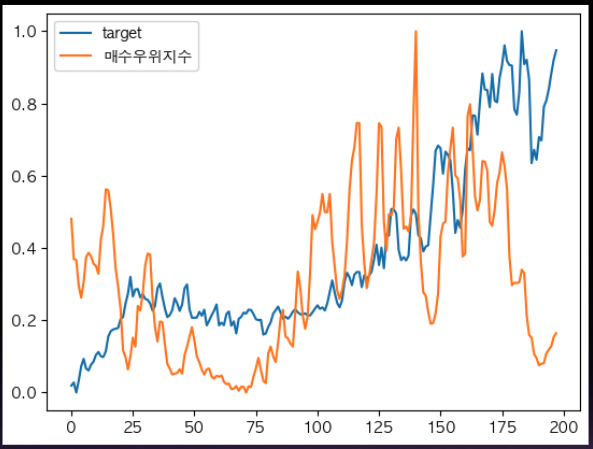

[](https://classroom.github.com/a/D1pZhJxu)
# 서울시 부동산 가격예측 경진대회 - 11조

## Team

| | | | | 
| :--------------------------------------------------------------: | :--------------------------------------------------------------: | :--------------------------------------------------------------: | :--------------------------------------------------------------: | 
|            [기현우](https://github.com/UpstageAILab)             |            [조수한](https://github.com/UpstageAILab)             |            [김민준](https://github.com/UpstageAILab)             |            [김홍석](https://github.com/UpstageAILab)             |            
|                            EDA, Feature Engineering, Modeling                            |                            EDA, Feature Engineering, Modeling                            |                            EDA, Feature Engineering, Modeling                             |                            EDA, Feature Engineering, Modeling                    

## 1. Competiton Info

### Overview

- 이번 대회는 Upstage Ai Lab 3기에서 진행한 ```서울시 부동산 가격예측``` 대회 입니다.

- 데이터셋은 ```train.csv```, ```test.csv```, ```subway.csv```, ```bust.csv```로 총 4가지의 파일이 주어집니다.

- 데이터셋과 모델링과 같은 상세 내용은 아래 단원들에서 소개하겠습니다.

### Timeline

- 시작일 : 2024.07.09
- 종료일 : 2024.07.19


### Evaluation

$$ RMSE = \sqrt{\frac{1}{n} \sum_{i=1}^n(y_i - \hat y_i)^2} $$

## 2. Components

### Directory
    upstage-ml-regression-ml11
    ├── README.md
    ├── requirements.txt
    ├── docs  ## 발표자료
    │   └── pdf
    │       └── [패스트캠퍼스] Upstage AI Lab 3기_그룹 스터디11조.pptx
    ├── images ## README images
    └── src ## 팀원별 작업 폴더
        ├── 기현우
        ├── 조수한
        ├── 김민준
        │   ├── crawling
        │   ├── eda
        │   └── model
        └── 김홍석
            ├── EDA
            ├── README.md
            ├── model
            └── submission


## 3. Data descrption

### Dataset overview


- train data : 1118822개
- test data : 9272개


### EDA
### 데이터 한계점 파악
1. 결측치
- 대부분의 Feature가 결측치가 80%이상

2. feature 신뢰도
- 특정 feature의 경우 동일한 값을 다르게 표현

3. feature 유용성
- 아파트 가격을 유추하기에 적절한지에 대한 의문

### 데이터 한계점 극복 방안
1. 결측치
- 크롤링, feature 제거, 통계치 활용

2. feature 신뢰도
- 실제 값과 비교
- 데이터 출처 확인

3. feature 유용성
- domain 지식 활용
- 새로운 feature 추가

### 결측치 처리
- 좌표X, 좌표Y
    - 크롤링
    - 시군구, 번지 활용

### 이상치 처리
1. 아파트별 target 이상치


- 아파트별 가격이 튀는 부분 탐색
- 좌우 2개씩 4개 데이터 평균과 현재 값 비교
- 2배 이상 작거나 큰 경우 평균치로 대체
- 성능이 안 좋아져 처리 폐기

2. 전용면적별 target 이상치


- 전용면적이 300이 넘는 데이터를 이상치로 판단
- 해당 데이터의 target을 강제로 2배 상향
- 모델 성능 상승이 없어 처리 폐기


3. 층별 target 이상치

  
  
  

- 층이 높으면 가격이 상승할 것이라는 가정
- 지하2층, 65층의 가격을 이상치로 파악
- 지하2층 : 한남더힐에 의해 평균값이 상승
- 65층 : 전체적으로 값이 낮으나 중간에 값이 더 낮은 데이터 존재
- 해당 데이터들을 삭제하는 방향으로 진행
- 모델 성능이 안 좋아져 처리 폐기

### Feature engineering
- 다양한 변수를 생성하여 사용

### feature 생성
1. 지하철, 버스 정보
- geopy 라이브러리 활용
- 주어진 지하철, 버스 데이터 활용
- 각 아파트와 정류장 사이의 거리 측정
- feature 생성
    - 가장 가까운 지하철 역과의 거리
    - 인근(1.5km 이내) 지하철 역 개수
    - 가장 가까운 정류장과의 거리
    - 인근(300m이내) 버스 정류장 개수
    - etc..

2. GDP, 금리, 인플레이션



- 외부 데이터 활용
- 계약년 or 계약년월에 맞춰 적용


3. 거래량, 구별 지가지수


- 외부 데이터 활용
- 계약년월, 구+계약년월에 맞춰 적용


4. 공시지가 평균, 매수우위지수



- 외부 데이터 활용


5. 30년이상 50년이하


- 건물나이가 30년부터 가격이 상승
- 50년 이후로 다시 하락

6. 아파트, 지하철 카테고리


- 아파트 이름에 특정 단어가 들어있는지 확인
- 지하철 노선 확인
- 카테고리화 


7. 아파트 가격 평균
- 아파트별 이전 거래 가격의 평균을 적용
- test에만 존재하는 아파트는 위치, 층, 면적이 비슷한 아파트 값들로 대체

8. 계약월_sin
- np.sin(2 * np.pi * df[‘계약월'] / 12)

### feature selection

1. Feature Importance


- 모델 생성 후 feature importance 값 참고
- 8개의 feature 선택


2. Feed Forward Selection


- feature를 추가할 때마다 새로운 모델 생성
- 성능이 좋아지면 해당 feature 사용


### 최종 모델에 사용한 feature


## 4. Modeling

### Model description

#### Baseline (LightGBM)

param : {n_estimators=100000, metric='rmse', data_sample_strategy='goss'}

- 모델과 하이퍼 파라미터를 Baseline으로 고정하고 feature version 업데이트마다 valid RMSE가 높은 예측 결과를 submission
- version에 대해 상세히 기록 후 동일 version 학습 결과의 편차 발생과 같은 이슈 공유

#### LightGBM hyperparameter tuning by Optuna

param : {'n_estimators': 50000, 'learning_rate': 0.018121450498089327, 'num_leaves': 133, 'feature_fraction': 0.753530055111983, 'bagging_fraction': 0.9831152659210419, 'bagging_freq': 1, 'min_child_samples': 18, 'min_child_weight': 6.936639163177618, 'lambda_l1': 0.321104316998921, 'lambda_l2': 1.283619100140314}

- hyperparameter tuning 시작 시점에 가장 좋은 점수(RMSE : 15385.0691)를 보인 v22 데이터셋으로 tuning 진행
- valid RMSE : 5521 으로 제출 후 좋지 않은 결과 RMSE : 110268


- 예측한 test 데이터의 target 값 시각화 해본 결과 이전까지의 예측 값 분포와 다르게 평탄화 되어있어 과적합으로 판단

#### XGBoost 
- v22 데이터셋으로 임의의 hyperparmeter값을 사용해 XGBoost 학습 후 제출한 결과 RMSE : 44346으로 baseline 모델보다 저조한 결과
- hyper parmeter tuning 후 학습 및 예측 결과 RMSE : 18177 tuning 전보다 좋은 점수이나 동일하게 baseline 모델보다 저조한 결과
  
- baseline(LightGBM), tuned XGBoost prediction 분포 비교
  

## 5. Result

### Leader Board
- 최종순위(1등) 10978.4676


### Presentation
[[패스트캠퍼스] Upstage AI Lab  3기 11조_아파트 실거래가 예측.pptx.pdf](https://github.com/user-attachments/files/16326799/Upstage.AI.Lab.3.11._.pptx.pdf)

## etc

### Meeting Log

- Notion
  https://www.notion.so/11-9db3a242427d490c9a488810d1d6b91d?p=46dd4fdcd04547f5b777f72133ab0797&pm=c
* Zoom 실시간 미팅(18:00~19:00)

### Reference

- _Insert related reference_
